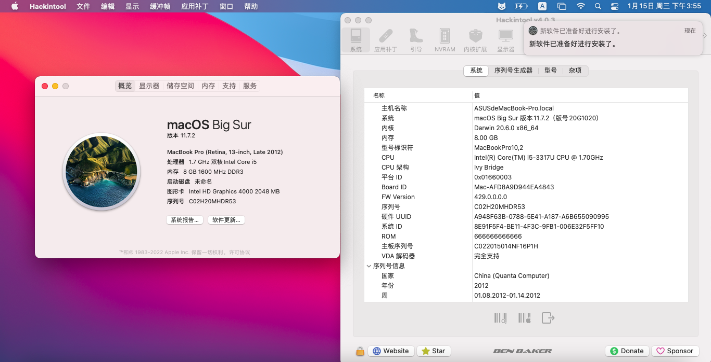

# Asus-K56CM-i5-3317U-BigSur-Hackintosh

应用于Asus K56CM的OpenCore 1.0.3的黑苹果引导 支持macOS Big Sur 11.7

注意：此EFI不含三码 实际使用时请自行使用[OCAT](https://github.com/ic005k/OCAuxiliaryTools)生成


### 配置清单
|类型|型号|规格|
|---|---|---|
|CPU|Intel i5-3317U|1.7 GHz|
|内存|三星 8GB DDR3|1600 MHz|
|硬盘|杂牌 SATA SSD|256 GB|
|显卡 1|Intel HD 4000|64-512 MB|
|显卡 2|NVIDIA GT 635M|2 GB|
|网卡|RealTek 8168|1000 Mbps|
|声卡|RealTek ALC270|立体声|
|Wi-Fi|Intel N 7260 MiniPCIe版|300 Mbps|
|操作系统|macOS Big Sur|11.7|

### 未解决的问题
- 独立显卡无法驱动
- 内置SDHC读卡器无法驱动
- 键盘快捷键不起作用
- 网卡不支持蓝牙 实际使用时可手动更换博通网卡
- 盒盖睡眠会睡死 需要手动在终端内强制关闭睡眠
```
sudo pmset -a sleep 0
sudo pmset -a hibernatemode 0
sudo pmset -a disablesleep 1
```
